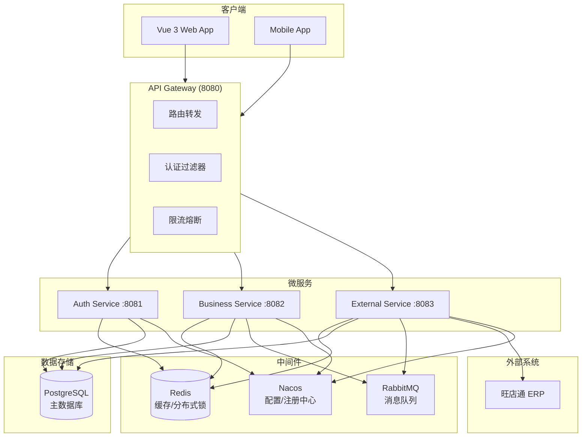
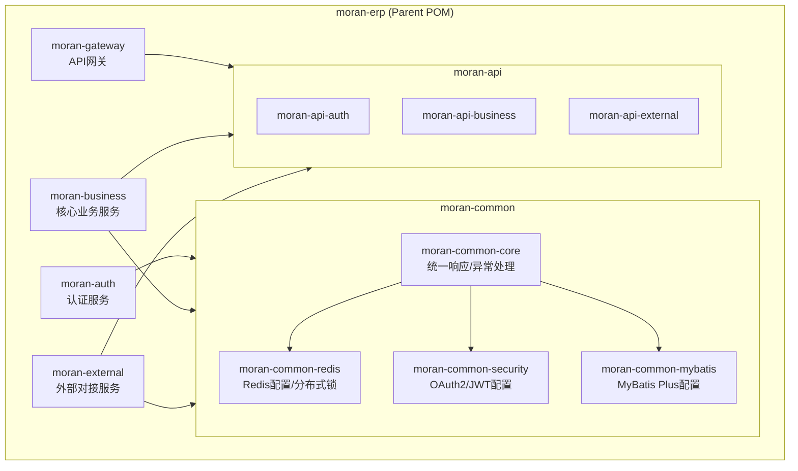
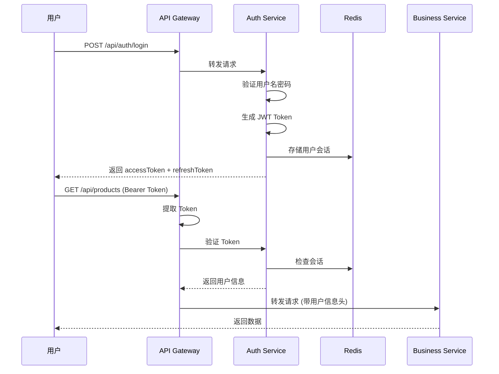
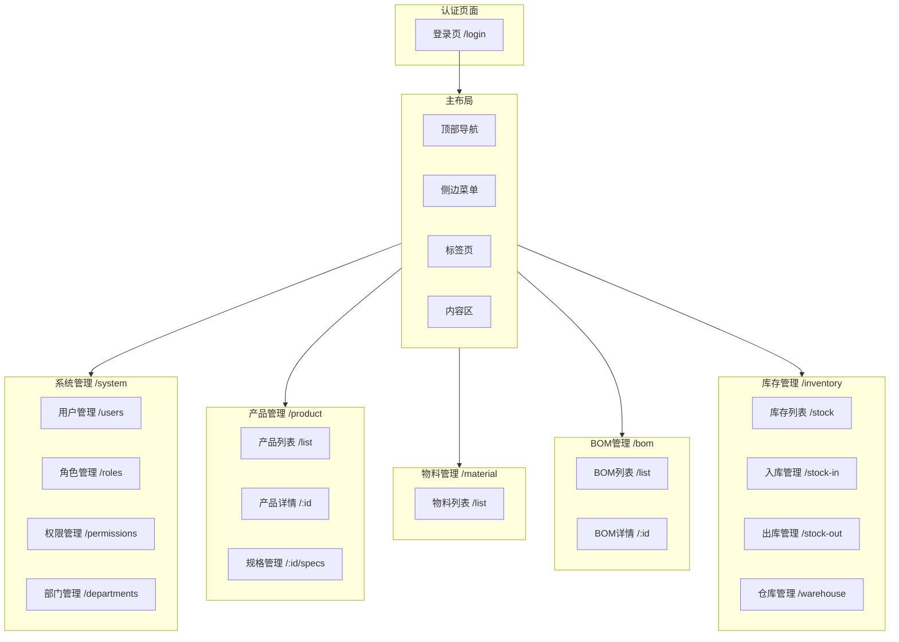
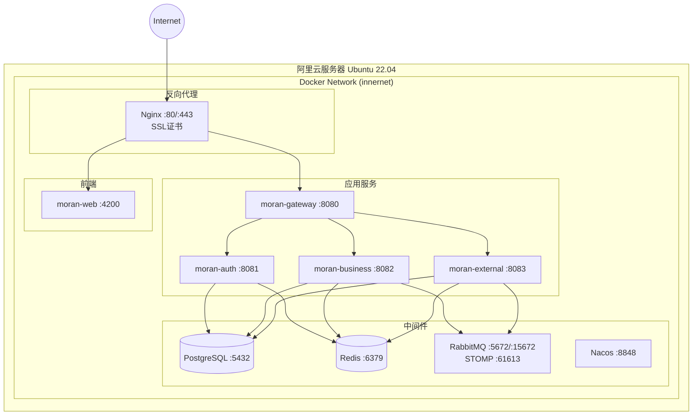

# Moran ERP - 架构设计文档

## 项目概述

珠宝行业ERP系统，支持产品管理、物料管理、BOM管理、库存管理、工作流引擎等功能。

**部署环境**: 阿里云 Ubuntu 22.04 服务器

---

## 技术栈

| 层级 | 技术选型 |
|-----|---------|
| 后端框架 | Java 21 + Spring Boot 3.4 |
| 微服务 | Spring Cloud Gateway + Nacos |
| 认证授权 | Spring Security + OAuth2 + JWT |
| 数据库 | PostgreSQL 16 (原MySQL 9.5) |
| ORM | MyBatis Plus 3.5 |
| 缓存 | Redis 7 |
| 消息队列 | RabbitMQ 4.2 (含STOMP插件) |
| 前端框架 | Vue 3.5 + TypeScript 5.x |
| UI组件库 | Element Plus |
| 状态管理 | Pinia |
| 构建工具 | Vite 6.x |

---

## 1. 系统架构图



---

## 2. 模块架构图



---

## 3. 数据模型图

```mermaid
erDiagram
    sys_user ||--o{ sys_user_role : has
    sys_role ||--o{ sys_user_role : has
    sys_role ||--o{ sys_role_permission : has
    sys_permission ||--o{ sys_role_permission : has
    sys_user }o--|| sys_department : belongs_to
    sys_department ||--o{ sys_department : has_children

    sys_user {
        bigint id PK
        varchar username UK
        varchar password
        varchar nickname
        varchar email
        varchar phone
        bigint department_id FK
        smallint status
        timestamp created_at
        timestamp updated_at
        timestamp deleted_at
    }

    sys_role {
        bigint id PK
        varchar code UK
        varchar name
        varchar description
        smallint status
        integer sort
    }

    sys_permission {
        bigint id PK
        varchar code UK
        varchar name
        smallint type
        bigint parent_id FK
        varchar path
        varchar component
        varchar icon
    }

    sys_department {
        bigint id PK
        varchar code UK
        varchar name
        bigint parent_id FK
        varchar path
        integer level
        bigint manager_id FK
    }

    base_brand ||--o{ base_product : has
    base_product ||--o{ base_product_spec : has
    base_product ||--o{ base_bom : has
    base_bom ||--o{ base_bom_item : has
    base_material ||--o{ base_bom_item : used_in

    base_product {
        bigint id PK
        varchar code UK
        varchar name
        bigint brand_id FK
        bigint category_id FK
        varchar unit
        jsonb images
        text description
        smallint status
    }

    base_product_spec {
        bigint id PK
        bigint product_id FK
        varchar code UK
        varchar name
        varchar barcode
        jsonb specs
        decimal retail_price
        decimal cost_price
    }

    base_material {
        bigint id PK
        varchar code UK
        varchar name
        varchar category
        varchar unit
        jsonb specs
        jsonb properties
    }

    base_bom {
        bigint id PK
        varchar code UK
        bigint product_id FK
        bigint spec_id FK
        varchar version
        smallint status
    }

    base_bom_item {
        bigint id PK
        bigint bom_id FK
        bigint material_id FK
        decimal quantity
        decimal loss_rate
    }

    inv_warehouse ||--o{ inv_inventory : has
    base_product ||--o{ inv_inventory : has
    inv_warehouse ||--o{ inv_stock_in : has
    inv_stock_in ||--o{ inv_stock_in_item : has
    inv_warehouse ||--o{ inv_stock_out : has
    inv_stock_out ||--o{ inv_stock_out_item : has

    inv_warehouse {
        bigint id PK
        varchar code UK
        varchar name
        smallint type
        bigint parent_id FK
        varchar address
        smallint status
    }

    inv_inventory {
        bigint id PK
        bigint warehouse_id FK
        bigint product_id FK
        bigint spec_id FK
        varchar batch_no
        decimal total_qty
        decimal available_qty
        decimal locked_qty
    }

    inv_stock_in {
        bigint id PK
        varchar code UK
        bigint warehouse_id FK
        smallint type
        bigint source_id
        decimal total_qty
        smallint status
    }

    inv_stock_in_item {
        bigint id PK
        bigint stock_in_id FK
        bigint product_id FK
        bigint spec_id FK
        varchar batch_no
        decimal quantity
        decimal unit_price
    }

    wf_definition ||--o{ wf_status : has
    wf_definition ||--o{ wf_action : has
    wf_status ||--o{ wf_transition : from
    wf_status ||--o{ wf_transition : to
    wf_action ||--o{ wf_transition : triggers

    wf_definition {
        bigint id PK
        varchar code UK
        varchar name
        varchar entity_type
        smallint status
    }

    wf_status {
        bigint id PK
        bigint definition_id FK
        varchar code
        varchar name
        boolean is_initial
        boolean is_final
    }

    wf_action {
        bigint id PK
        bigint definition_id FK
        varchar code
        varchar name
        smallint type
    }

    wf_transition {
        bigint id PK
        bigint definition_id FK
        bigint from_status_id FK
        bigint action_id FK
        bigint to_status_id FK
    }
```

---

## 4. 认证授权流程



---

## 5. 页面结构图



---

## 6. API 设计规范

### 统一响应格式

```json
{
    "code": 200,
    "message": "success",
    "data": {},
    "timestamp": 1234567890000
}
```

### 错误码定义

| 错误码 | 说明 |
|-------|------|
| 200 | 成功 |
| 400 | 参数错误 |
| 401 | 未登录或Token过期 |
| 403 | 权限不足 |
| 404 | 资源不存在 |
| 500 | 服务器内部错误 |

### RESTful API 规范

| 操作 | 方法 | URL | 说明 |
|-----|------|-----|------|
| 创建 | POST | /api/resources | 创建资源 |
| 列表 | GET | /api/resources | 分页查询 |
| 详情 | GET | /api/resources/{id} | 获取详情 |
| 更新 | PUT | /api/resources/{id} | 更新资源 |
| 删除 | DELETE | /api/resources/{id} | 删除资源 |

---

## 7. 环境变量

```env
# PostgreSQL
SPRING_DATASOURCE_URL=jdbc:postgresql://db:5432/moran_erp
SPRING_DATASOURCE_USERNAME=postgres
SPRING_DATASOURCE_PASSWORD=${DB_PASSWORD}

# Redis
SPRING_REDIS_HOST=redis
SPRING_REDIS_PORT=6379
SPRING_REDIS_PASSWORD=${REDIS_PASSWORD}

# Nacos
SPRING_CLOUD_NACOS_CONFIG_SERVER_ADDR=nacos:8848
SPRING_CLOUD_NACOS_DISCOVERY_SERVER_ADDR=nacos:8848

# JWT
JWT_SECRET=${JWT_SECRET}
JWT_EXPIRATION=86400000

# 网关路由
GATEWAY_ROUTES_AUTH_URI=http://moran-auth:8081
GATEWAY_ROUTES_BUSINESS_URI=http://moran-business:8082
GATEWAY_ROUTES_EXTERNAL_URI=http://moran-external:8083

# RabbitMQ
SPRING_RABBITMQ_HOST=rabbitmq
SPRING_RABBITMQ_PORT=5672
SPRING_RABBITMQ_USERNAME=rabbit_admin
SPRING_RABBITMQ_PASSWORD=${RABBITMQ_PASSWORD}
```

---

## 8. 阿里云部署架构

### 8.1 部署拓扑图



### 8.2 Docker容器规划

| 容器名 | 镜像 | 端口映射 | 说明 |
|-------|------|---------|------|
| proxy | nginx:1.29-alpine | 80:80, 443:443 | 反向代理、SSL终止 |
| db | postgres:16 | 5432:5432 | PostgreSQL数据库 |
| redis | redis:7 | 6379:6379 | 缓存服务 |
| rabbitmq | rabbitmq:4.2-management-alpine | 5672:5672, 15672:15672, 61613:61613 | 消息队列+管理界面+STOMP |
| nacos | nacos/nacos-server:v2.3 | 8848:8848 | 配置中心/服务发现 |
| moran-web | moran-web:0.0.1 | 4200:80 | 前端应用 |
| moran-gateway | moran-gateway:0.0.1 | 8080:80 | API网关 |
| moran-auth | moran-auth:0.0.1 | 8081:80 | 认证服务 |
| moran-business | moran-business:0.0.1 | 8082:80 | 业务服务 |
| moran-external | moran-external:0.0.1 | 8083:80 | 外部对接服务 |

### 8.3 Nginx路由配置

```nginx
# 域名: www.moranzhubao.com

# 前端
location / {
    proxy_pass http://moran-web:80;
}

# API网关
location /api/ {
    rewrite ^/api(.*)$ $1 break;
    proxy_pass http://moran-gateway:80;
}

# WebSocket (用于实时通知)
location /ws/ {
    rewrite ^/ws(.*)$ $1 break;
    proxy_pass http://moran-gateway:80;
    proxy_http_version 1.1;
    proxy_set_header Upgrade $http_upgrade;
    proxy_set_header Connection "upgrade";
    proxy_read_timeout 300s;
}

# RabbitMQ管理界面 (可选)
location /rabbitmq/ {
    rewrite ^/rabbitmq(.*)$ $1 break;
    proxy_pass http://rabbitmq:15672;
}
```

### 8.4 Docker网络配置

```yaml
# 所有容器使用外部网络 innernet
networks:
  innernet:
    external: true
```

创建网络命令：
```bash
docker network create innernet
```

### 8.5 数据持久化路径

| 容器 | 宿主机路径 | 容器路径 | 说明 |
|-----|-----------|---------|------|
| db | /ext/dockers/db/data | /var/lib/mysql | 数据库数据 |
| db | /ext/dockers/db/config | /etc/mysql | 数据库配置 |
| redis | /ext/dockers/redis/data | /var/lib/redis | Redis数据 |
| rabbitmq | data卷 | /var/lib/rabbitmq | RabbitMQ数据 |
| nginx | /ext/dockers/proxy/ssl | /etc/ssl/certs | SSL证书 |
| nginx | /ext/dockers/proxy/logs | /var/log/nginx | Nginx日志 |
| apps | /ext/moran/logs | /stdout | 应用日志 |
| apps | /ext/moran/upload | /upload | 上传文件 |

### 8.6 日志配置

```yaml
logging:
  driver: "json-file"
  options:
    max-size: "10m"    # 单个日志文件最大10MB
    max-file: "3"      # 最多保留3个文件
```

---

## 9. 开发阶段

| 阶段 | 内容 | 任务ID |
|-----|------|--------|
| 基础架构 | 项目初始化、公共模块 | 1-6 |
| 认证服务 | OAuth2、用户角色权限、部门 | 7-13 |
| API网关 | 路由、认证过滤器 | 14-15 |
| 前端基础 | HTTP封装、状态管理、布局 | 16-23 |
| 产品物料 | 产品、规格、物料、BOM | 24-30 |
| 库存管理 | 仓库、库存、出入库 | 31-37 |
| 工作流 | 状态机引擎、API | 38-39 |
| 集成部署 | Nacos、Docker、测试、文档 | 40-42 |

---

## 10. 从旧系统迁移要点

### 10.1 数据库迁移

| 原系统 | 新系统 | 说明 |
|-------|-------|------|
| MySQL 9.5 | PostgreSQL 16 | 数据库更换 |
| 分散多库 | 单库Schema隔离 | 简化运维 |
| UUID主键 | BIGSERIAL主键 | 性能优化 |

### 10.2 服务迁移

| 原服务 | 端口 | 新服务 | 端口 |
|-------|------|-------|------|
| iErp (Management) | 26000 | moran-auth | 8081 |
| iBus (Business) | 26006 | moran-business | 8082 |
| iApi (External) | 26010 | moran-external | 8083 |
| iMon (Monitor) | 26100 | (合并到business) | - |
| iWs (WebSocket) | 26001 | (合并到gateway) | 8080 |

### 10.3 功能保留

- ✅ 旺店通ERP对接 (WDT SDK迁移)
- ✅ 工作流引擎
- ✅ 权限系统 (增强为OAuth2)
- ✅ 库存管理
- ✅ 生产管理
